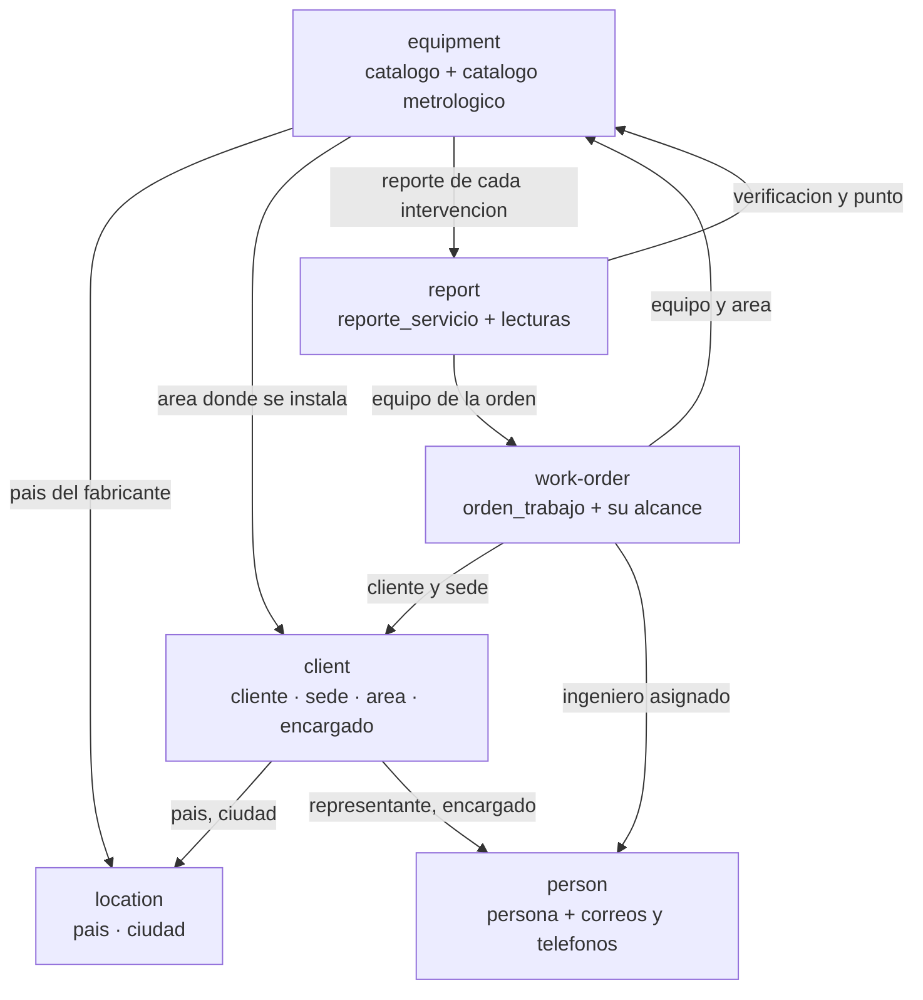
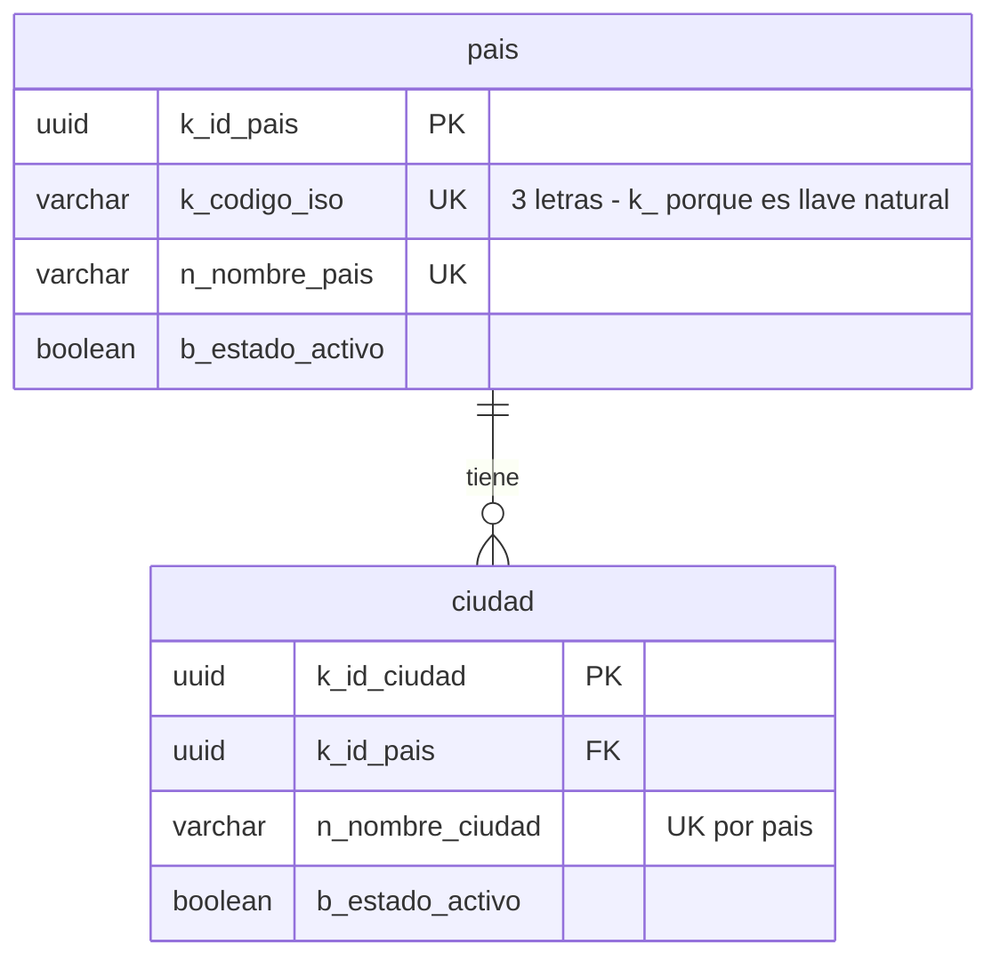
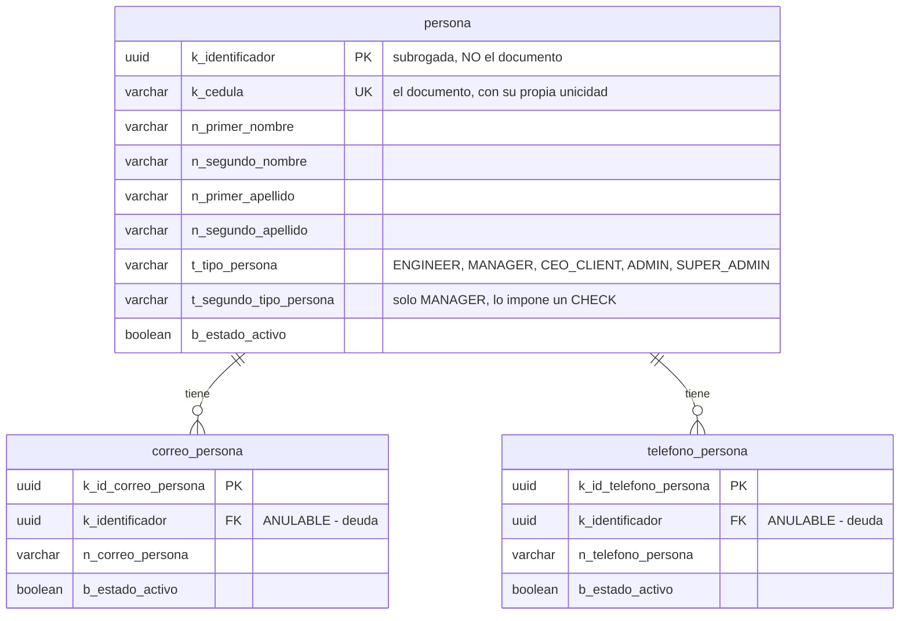
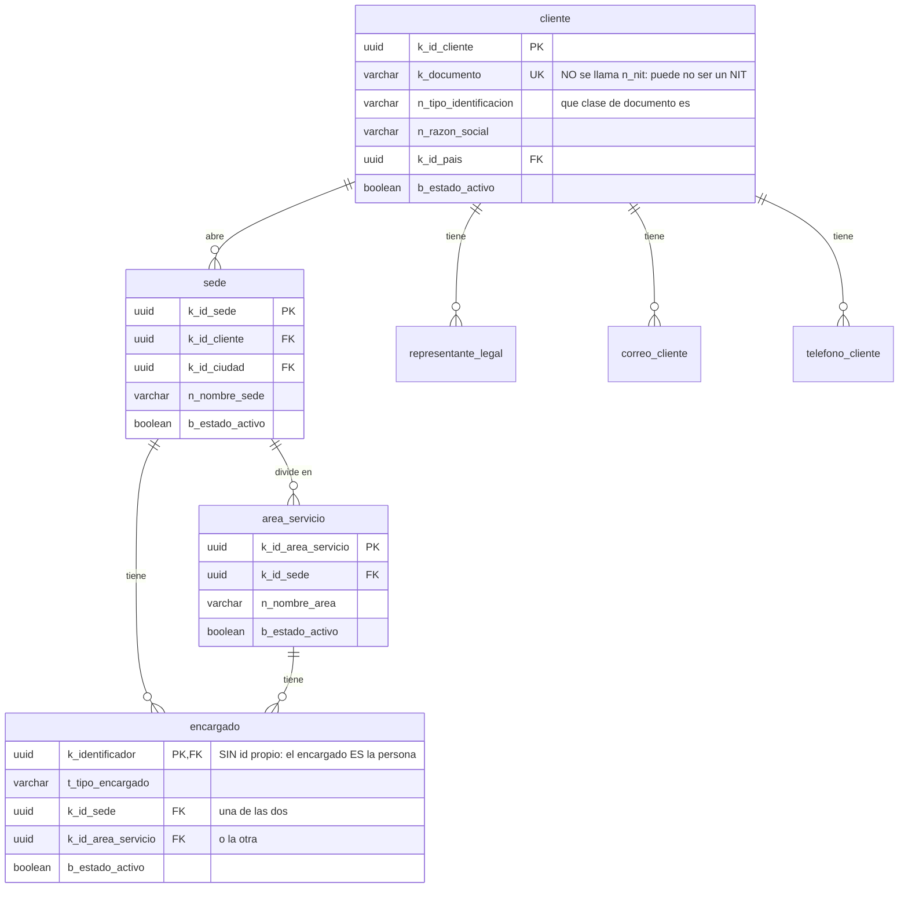
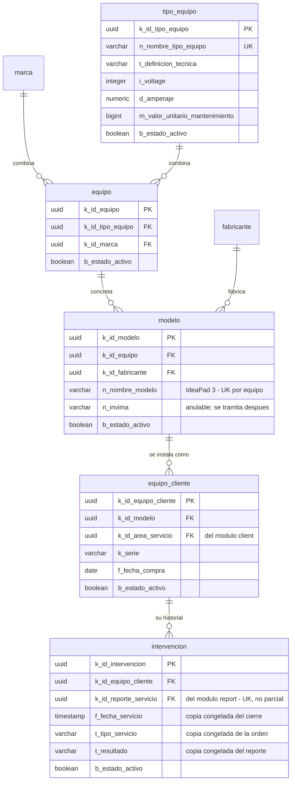
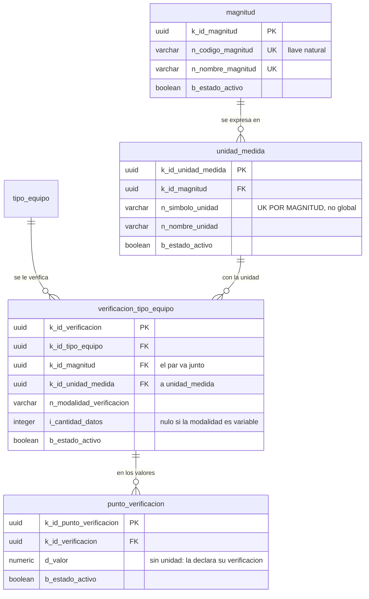
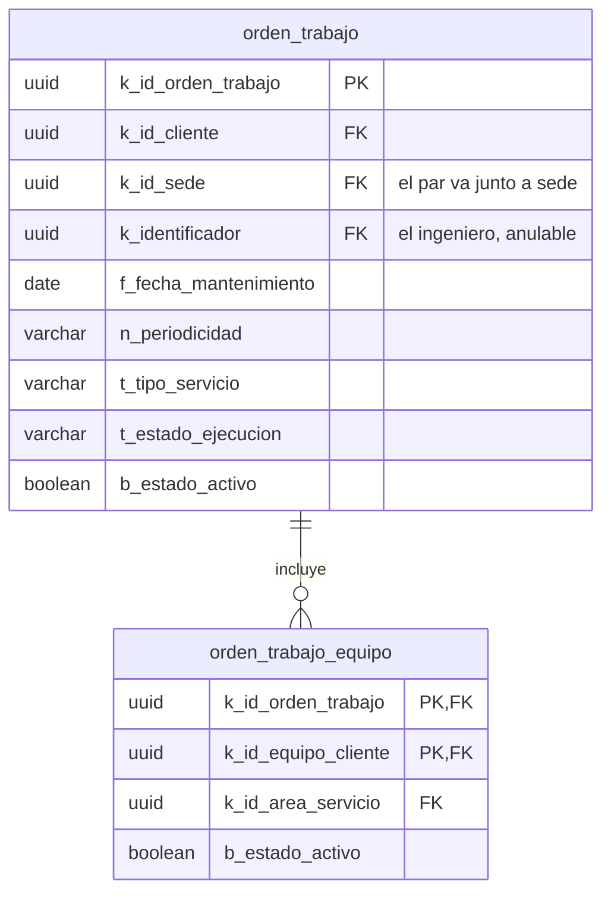
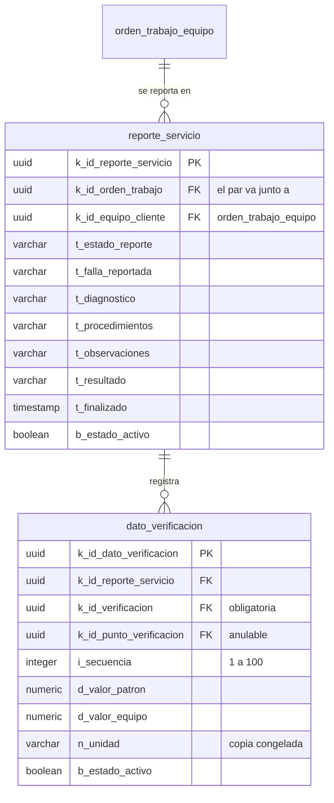

# El esquema de MalphasOS, hoy

**Esta nota existe porque no había ninguna que describiera esta base de datos.** Las dos de este
directorio —[[esquema-bd-v4]] y [[evolucion-esquema-v1-v4]]— describen el esquema del **sistema
original**, generado con Enterprise Architect, y la primera se anuncia como «el esquema PostgreSQL
**actual**»: era cierto cuando se escribió y dejó de serlo al construirse MalphasOS. Quien preguntaba
«cómo tenemos la base de datos» aterrizaba ahí y leía las 27 tablas del sistema viejo.

**Coincidencia que conviene no confundir**: el original tenía **27** tablas y MalphasOS tiene **26**.
No son las mismas menos una; es otro modelo con un número parecido.

## Cómo se hizo esta nota, y cómo se vuelve a hacer

> **Corregido el 2026-10-04, y la corrección es sobre esta misma sección.** Decía, sin matizar, que la
> nota estaba «generada leyendo la base de datos en marcha, no las migraciones ni la memoria». Era
> **verdad a medias**: la lista de tablas y el grafo de foráneas sí se leyeron de `information_schema`,
> y **los nombres de columna se escribieron de memoria**. Al revisarla al día siguiente aparecieron
> **doce columnas que no existen** en seis tablas, más una llave primaria inventada en `encargado`:
>
> - `pais.n_codigo_iso` era `k_codigo_iso` —`k_` porque es llave natural—.
> - `persona` tenía cuatro nombres falsos: su llave primaria es **subrogada** y el documento vive en
>   `k_cedula`, no al contrario; y los nombres van en cuatro columnas, no en dos.
> - `cliente.n_nit` **no existe**: es `k_documento` más `n_tipo_identificacion`, porque el documento de
>   un cliente puede no ser un NIT.
> - `encargado` **no tiene identificador propio**: su llave primaria es la de la persona.
> - `orden_trabajo` tenía tres nombres mal, entre ellos la fecha.
>
> **Un diagrama con nombres plausibles y falsos es peor que no tener diagrama**, porque se cita. Y la
> lección no es «mirar mejor»: es que la parte verificada y la inventada iban en la misma nota sin
> distinguirse. Por eso ahora hay un guion que lo comprueba —ver abajo— y por eso esta sección dice qué
> se leyó y qué no.

**Lo que sí se lee de la base**: la lista de tablas, el grafo de foráneas y los conteos. Las migraciones
son once archivos y el estado final no se ve en ninguno; `information_schema` sí lo ve. Las consultas, y
**se recalculan antes de citarlas**:

```sql
-- tablas (sin flyway_schema_history)
SELECT count(*) FROM information_schema.tables
WHERE table_schema = 'public' AND table_type = 'BASE TABLE'
  AND table_name <> 'flyway_schema_history';

-- foraneas, y el grafo entero
SELECT tc.table_name, kcu.column_name, ccu.table_name AS apunta_a, tc.constraint_name
FROM information_schema.table_constraints tc
         JOIN information_schema.key_column_usage kcu ON kcu.constraint_name = tc.constraint_name
         JOIN information_schema.constraint_column_usage ccu ON ccu.constraint_name = tc.constraint_name
WHERE tc.constraint_type = 'FOREIGN KEY' AND tc.table_schema = 'public';
```

### El guion que comprueba que las columnas existen

`SecondBrain/herramientas/verificar-esquema.py` recorre los diagramas de abajo y exige que cada columna
dibujada exista en la base. Con los contenedores arriba, desde la raíz del repositorio:

```bash
docker compose exec -T postgres psql -U malphasos -d malphasos_db -t -A -F'|' \
  -c "SELECT table_name, column_name FROM information_schema.columns \
      WHERE table_schema='public' AND table_name <> 'flyway_schema_history';" \
  | python3 SecondBrain/herramientas/verificar-esquema.py
```

Devuelve 0 si todo cuadra y 1 nombrando lo que sobra. **Se vio fallar** cambiando `k_cedula` por
`n_cedula`, que es lo que este proyecto exige de una comprobación.

**No comprueba tipos ni marcas `PK`/`FK`**, y eso hay que saberlo: la llave primaria inventada de
`encargado` no la habría cazado. Caza la clase de error que de hecho se cometió —nombres de columna— y
lo demás sigue dependiendo de leer el diagrama contra `\d tabla`.

## Las cifras, medidas el 2026-10-04

| | |
|---|---|
| Migraciones aplicadas | **13** (`V1`…`V13`) |
| Tablas de dominio | **27** |
| Llaves foráneas | **37**, de las cuales **4 compuestas** |
| Restricciones `CHECK` propias | **31** |
| Índices únicos **parciales** | **5** |
| Tablas con borrado lógico | **27 de 27** — universal, sin excepción |

> **Recontado el 2026-10-04, por la tarde.** Las cifras de la mañana eran 11 migraciones, 26 tablas, 35
> foráneas y 29 `CHECK`. Entraron `V12` —`intervencion`, con dos foráneas y dos `CHECK`— y `V13`, que
> no cambia el esquema: rellena. Los índices únicos parciales **siguen siendo cinco**, y no es un
> descuido: la restricción de una línea por reporte de `intervencion` **no es parcial a propósito**.

**El borrado lógico es universal y eso es una afirmación comprobada, no una convención declarada**: la
consulta que busca tablas sin `b_estado_activo` devuelve cero filas.

## El mapa de módulos

Cada módulo es un hexágono del backend y sus tablas no se mezclan. Las flechas son las referencias que
**cruzan** de un módulo a otro, que son las que importan al leer el código: dentro de un módulo se
navega por objetos, entre módulos siempre por identificador.



**Desde `V12` hay un par de módulos con referencias en los dos sentidos**, y es el único: `report`
apunta a `equipment` —la verificación y el punto de cada lectura— y `equipment` apunta a `report`
—`intervencion` guarda de qué reporte salió—. **El código no tiene ese ciclo**, y a propósito:
`InterventionEntity` guarda el identificador del reporte como un UUID suelto, sin `@ManyToOne`, y el
oyente que la escribe vive en `report` y entra por un puerto que `equipment` publica. El ciclo existe
solo en la base, donde la foránea es lo que garantiza que una línea del historial no apunte a un reporte
inexistente. Quitarla rompería el ciclo y perdería esa garantía. Ver [[hoja-de-vida]].

## `location` — 2 tablas

Datos de referencia. Los siembra `V7`: 249 países de la ISO 3166-1 y 1.350 ciudades. **No hay pantalla
que los cree**, y es deliberado: son lo primero que una instalación nueva necesita.



**Defecto conocido**: a `ciudad` le falta un nivel de división administrativa. 64 nombres de municipio
se repiten entre departamentos colombianos —cuatro La Unión, cuatro Villanueva, cuatro Buenavista— y
`UQ_ciudad_nombre_por_pais` los haría imposibles.

> **Matizado el 2026-10-04, porque esta frase engañaba.** Decía que el índice «los hace imposibles» y
> ahí se cortaba, de modo que un lector concluye que esos 64 municipios **no se pueden registrar**. No
> es así: `V7` los desambigua metiendo el departamento en el nombre —`La Unión (Nariño)`— y **los 1.103
> municipios están sembrados**, comprobado contra la base. Lo que queda es deuda de modelo y no un
> hueco de datos: el nombre carga con información que debería ser una columna, y ordenar o buscar por
> departamento sigue siendo imposible. La fila completa, en [[deuda-tecnica-y-riesgos]].
>
> Se corrige dejando constancia porque **el resumen truncado llegó a inducir el error**: en esta misma
> sesión se dio por hecho, citando esta línea, que había 64 municipios que no se podían dar de alta.

Ver [[dominio-ubicacion]].

## `person` — 3 tablas



**Dos deudas propias viven aquí**: el dueño es **anulable** en las dos tablas hijas —al contrario que
en los contactos del cliente—, y **ningún correo está marcado como principal**, que es lo que impide
sincronizar el correo con Keycloak al editar. Corregir cualquiera de las dos exige su propia migración.

## `client` — 7 tablas



**Un encargado lo es de una sede o de un área, nunca de las dos ni de ninguna**, y eso lo impone un
`CHECK` y no una convención.

## `equipment` — 11 tablas

Son tres cosas en un módulo: la **cadena del catálogo** (seis tablas), el **catálogo metrológico con lo
que se verifica** (cuatro, de `V8` y `V10`) y, desde `V12`, el **historial de intervenciones** de cada
equipo instalado, que es la única sección de su hoja de vida con tabla propia.

**«Equipo» significa dos cosas**, y es la trampa de este módulo: `equipo` es una **categoría** —la
combinación de una marca y un tipo— y `equipo_cliente` es la **máquina** instalada en un área.



**`modelo` tiene nombre desde `V11`**, y hasta entonces no lo tenía: lo único legible que llevaba era
su registro INVIMA, que es un número de trámite **y es anulable**, de modo que cabía un modelo sin nada
que escribir en una fila. El nombre es obligatorio y **único por `equipo`** —«Serie 3» puede ser de dos
marcas distintas, y la marca vive en `equipo`—, con índice parcial como el resto.

**`tipo_equipo` ya no dice cómo se verifica**: hasta el 2026-10-03 tenía `b_verificable`,
`n_tipo_verificacion` e `i_cantidad_datos`, y las tres se fueron en `V10`. El booleano era exactamente
«hay modalidad» —redundante por construcción— y las otras dos no pueden ser del tipo, porque valen
distinto según la magnitud.



**Un tipo se verifica en varias magnitudes**, y es la corrección del 2026-10-03: un termohigrómetro
mide temperatura **y** humedad relativa, con unidades, puntos y modalidades distintas. Con el modelo
anterior había que registrarlo como dos tipos de equipo. Las 20 magnitudes y 46 unidades las siembra
`V10` y **no hay pantalla que las administre**, igual que los países. Ver
[[dominio-equipo-mantenimiento]].

## `work-order` — 2 tablas



**`orden_trabajo_equipo` se identifica por el par**, sin identificador propio: un equipo está en una
orden o no está, y no hay nada que decir dos veces sobre eso.

## `report` — 2 tablas



**La unidad de una lectura es una copia, no una foránea**, y es deliberado: reconfigurar un tipo no
debe cambiar un reporte ya firmado. Ver [[congelar-una-referencia-historica]].

## Las 4 foráneas compuestas, que son reglas y no adornos

Una foránea compuesta impone en el esquema algo que con dos foráneas sueltas quedaría abierto. Son
cuatro y cada una tapa un estado que de otro modo se podría escribir:

| Tabla | El par | Lo que impide |
|---|---|---|
| `orden_trabajo` | (sede, cliente) → `sede` | Una orden en una sede **de otro cliente** |
| `reporte_servicio` | (orden, equipo) → `orden_trabajo_equipo` | Un reporte de un equipo **que la orden no incluyó** |
| `verificacion_tipo_equipo` | (magnitud, unidad) → `unidad_medida` | Medir temperatura **en %HR** |
| `dato_verificacion` | (verificación, punto) → `punto_verificacion` | Una lectura en un punto **de otra verificación** |

**Y las cuatro admiten el caso nulo sin una regla extra**: una foránea compuesta con alguna columna
nula **no se comprueba** —es `MATCH SIMPLE`, lo que PostgreSQL hace por omisión—, de modo que la
lectura sin punto pasa y la que trae punto queda atada.

## Los 5 índices únicos parciales, y por qué son parciales

`UQ_reporte_servicio_activo`, `UQ_verificacion_magnitud_activa_por_tipo`,
`UQ_punto_verificacion_activo`, `UQ_dato_verificacion_activo` y, desde `V11`,
`UQ_modelo_nombre_activo_por_equipo`. Los cinco llevan `WHERE b_estado_activo`, y la razón es la misma
en todos: **aquí nada se borra**. Una restricción normal impediría volver a dar de alta algo que se
retiró, de modo que reconfigurar hacia atrás sería imposible.

**Y cobran un precio**: Hibernate vacía los `INSERT` antes que los `UPDATE`, así que
sustituir una fila activa por otra equivalente choca contra el índice. Un índice **parcial** no se
puede declarar diferido —`DEFERRABLE` es de las restricciones, y una restricción no admite `WHERE`—,
así que el orden se impone en el adaptador con un `saveAndFlush` intermedio. Lo pagaron dos módulos:
`report` el 2026-09-27 y `equipment` el 2026-10-03, donde llevaba **latente** porque ninguna prueba lo
ejercía. Ver [[stack-spring-boot-4-particularidades]].

## Lo que el esquema **no** dice

Veinte reglas de negocio no están aquí y viven en los servicios, y no por descuido: el esquema no
puede expresarlas. «No abrir un área en una sede cerrada» exige mirar otra fila; «el punto pertenece al
tipo del equipo reportado» son cuatro saltos desde `equipo_cliente`. Y hay una tercera categoría: una
restricción que el esquema **podría** expresar y que **no debe**, porque congelaría el otro lado — ver
[[congelar-una-referencia-historica]].

## Lo que falta

- **El vencimiento de calibración** no tiene columna, y es lo que las alertas necesitan. Es lo único
  que queda de la segunda tanda de `equipment`.
- **El filtrado por dueño no necesitó ninguna columna nueva**, y esta línea decía lo contrario. Decía
  que «no existe: ninguna tabla lleva columna de pertenencia que el API use para recortar lo que un
  usuario ve». **Construido el 2026-10-04 sin migración**: la pertenencia ya estaba, repartida entre
  `representante_legal` —cuya llave compuesta permite que una persona represente a varios clientes— y
  el hecho de que `persona.k_identificador` **es** el identificador que asigna Keycloak. Lo que el
  esquema no tiene, y sigue sin tener, es una columna que lo diga en un solo sitio: el camino del dato
  al dueño son hasta tres saltos y los recorre la capa de aplicación. Ver [[filtrado-por-dueno]].
- **La firma digital** no tiene tablas todavía. (Esta línea decía también «la hoja de vida como entidad»: **la hoja de vida no es una entidad** y no tiene tabla; lo que sí la tiene desde `V12` es su historial, `intervencion`. Ver [[hoja-de-vida]].)
